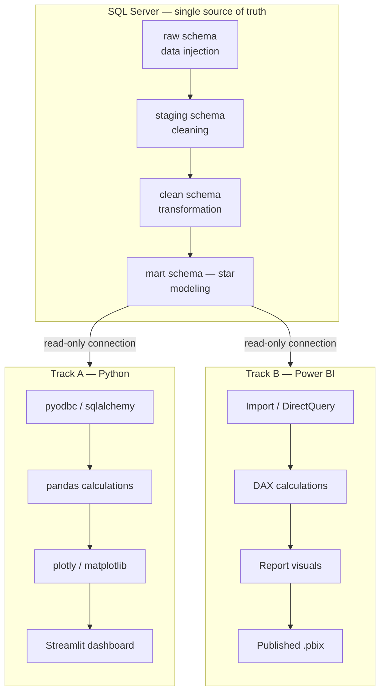
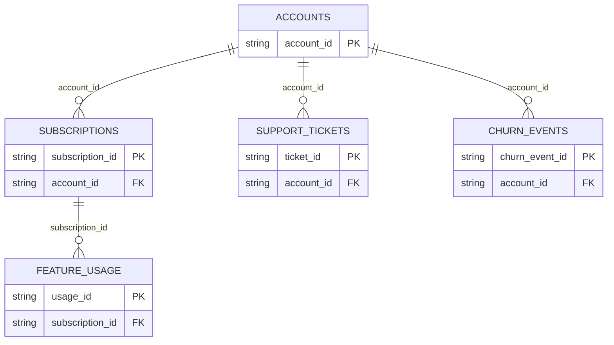

# KPIScope

A project that pulls a company's customer/subscription/support data into one place, so a data team can dig into it in Python and leadership can check a Power BI scorecard every week — both looking at the exact same numbers.

This README explains **what problem this solves** and **what all the business terms mean**, written for someone with little business background. If a word feels obvious to you already, skip it — this is meant to be a lookup, not a lecture.

---

## 1. What problem is this actually solving?

Picture a company where:
- The Sales team has their own spreadsheet of "new customers this month."
- The Customer Success team has their own list of "customers we lost."
- Finance manually adds up subscription revenue by hand at the end of each month.

None of these three numbers agree with each other, because each team built their own version from their own partial data. Nobody can say for sure "how much money are we making" or "are we gaining or losing customers faster" — and by the time someone finally notices a problem (like a wave of customers cancelling), months have already gone by.

**KPIScope's fix:** combine every relevant piece of data — accounts, subscriptions, feature usage, support tickets, churn events — into one clean, single source, so every team is reading from the same numbers instead of five different spreadsheets that disagree.

---

## 2. Business jargon, explained

### MRR — Monthly Recurring Revenue
The amount of money the company earns *every month* from subscriptions. If a customer pays $100/month, they contribute $100 to MRR. This is the core "how much money is coming in right now, on a recurring basis" number.

### ARR — Annual Recurring Revenue
The same idea as MRR, just scaled up to a yearly view. Usually just `MRR × 12`. Companies use ARR when talking about big-picture, year-level revenue instead of month-to-month.

### Churn / Churn Rate
"Churn" = a customer cancels or leaves. "Churn rate" = what percentage of customers left in a given period. If you had 100 customers and 5 cancelled this month, that's a 5% churn rate. High churn = the business is leaking customers.

### Expansion (MRR)
When an *existing* customer pays the company **more** money than before — e.g., they upgrade to a bigger plan, add more seats/users, or buy an add-on. This grows revenue without needing a single new customer.

### Contraction (MRR)
The opposite of expansion — an existing customer downgrades or removes something, so the company earns **less** from them than before (but they haven't fully cancelled yet).

### Net Revenue Retention (NRR)
A single number that answers: "If we got zero new customers this year, would our revenue from existing customers alone have grown or shrunk?" It's calculated as:

```
(Starting MRR − Revenue lost to churn + Revenue gained from expansion) ÷ Starting MRR
```

- **Above 100%** = existing customers are spending *more* over time, even accounting for the ones who left. This is considered a very healthy sign for a subscription business.
- **Below 100%** = the business is shrinking from within, even if it's still adding new customers on top.

### Acquisition Channel
*How* a customer found and joined the company — e.g., through a Google ad, a referral from another customer, a sales cold-call, a free-trial signup, etc. Businesses track this to figure out which marketing/sales channel brings in customers who actually stick around, versus ones who sign up once and leave quickly.

### Plan Tier
The subscription "level" a customer is on — e.g., Basic, Pro, Enterprise. Usually tied directly to price and feature access.

### Seats
How many individual users a company's account is paying for (like "we bought 20 seats" for 20 employees to use the product).

### CSAT / Satisfaction Score
A rating a customer gives after a support interaction — usually something like 1–5 stars — showing how happy they were with the help they got.

### SLA-style metrics (Resolution Time, First Response Time)
How long it took a support ticket to get a first reply, and how long it took to fully resolve. Slow support is often an early warning sign that a customer might leave.

### Escalation
When a support ticket gets kicked up to a more senior or specialized team because the first person couldn't resolve it — usually a sign of a more serious or frustrating issue.

---

## 3. Data/technical jargon, explained

### Table / Row / Column
Think of each data file (accounts, subscriptions, etc.) as a spreadsheet. A **row** is one single record (e.g., one subscription). A **column** is one type of information about every record (e.g., "start date").

### Grain
"What does one row actually represent?" For example, in the `subscriptions` table, one row = one subscription (not one customer — a customer can have several subscriptions). Getting the grain wrong is one of the most common ways people miscalculate KPIs by accident (e.g., accidentally counting a customer twice).

### Primary Key
The column that makes every row in a table unique — like an ID number. No two rows should ever share the same primary key.

### Join / Join Key
"Joining" means connecting two tables together using a shared column, so you can pull information from both at once. For example, `subscriptions` and `support_tickets` don't share direct info, but both have `account_id` — so you can join them on that column to ask "which support tickets belong to which subscriptions."

### dtype (Data Type)
What *kind* of value a column holds — a number, text, a date, true/false, etc. Data often comes in as the wrong type (e.g., a date stored as plain text) and has to be "converted" before it can be used properly — that's what "transformations" below refers to.

### Null / Missing Value
An empty cell — no data recorded for that row/column. E.g., not every support ticket has a satisfaction score, because not every customer bothers to rate their experience.

### Flag
A column that's just `True`/`False` (yes/no) — e.g., `churn_flag = True` means "this subscription has churned."

### Proxy
A stand-in measurement used when the *exact* thing you want to measure isn't directly available in the data, but something closely related is. Proxies are useful but imperfect — they should always be labeled as estimates, not treated as the real number.

---


**Architecture:** One shared SQL Server pipeline (injection → cleaning → transformation → modeling) feeding TWO independent, parallel visualization tracks — Python and Power BI — both connecting read-only to the same finished tables and doing ONLY calculations + visuals.

**Methodology:** Agile (sprints, backlog, Definition of Done, sprint review)

---

## 0. Architecture



**Rule:** Injection, cleaning, transformation, and modeling happen **once**, entirely in SQL Server/SSMS. Python and Power BI never touch raw data — they only read from the finished `mart` schema and are each responsible for their own calculations and visuals, independently.

---

## 1. Project Setup

### 1.1 Repository Structure

```
kpiscope/
├── README.md
├── data/
│   └── raw/                         # original CSV files, untouched
├── sql/
│   ├── 01_create_raw_schema.sql
│   ├── 02_injection.sql
│   ├── 03_staging_cleaning.sql
│   ├── 04_transformation.sql
│   ├── 05_mart_star_schema.sql
│   └── 06_profiling_queries.sql
├── python/
│   ├── connection.py                 # SQL Server connection only
│   ├── calculations.py               # KPI calculations (pandas)
│   ├── visuals.py                    # chart-building functions
│   └── dashboard.py                  # Streamlit/Dash app entry point
├── powerbi/
│   └── KPIScope_Model.pbix
├── documentation/
│   ├── Data_Dictionary.md
│   ├── Data_Quality_Report.md
│   ├── Business_Insights.md
│   └── Sprint_Boards/
│       ├── sprint-0.md
│       ├── sprint-1.md
│       ├── sprint-2.md
│       ├── sprint-3.md
│       ├── sprint-4.md
│       ├── sprint-5.md
│       └── sprint-6.md
└── screenshots/
```

### 1.2 Components & Dependencies

| Layer | Component | Purpose |
|---|---|---|
| Database | SQL Server (Developer or Express edition) | Hosts all four schemas |
| Database client | SSMS (SQL Server Management Studio) | Write/run all SQL scripts |
| Python | Python 3.11+ | Runtime |
| Python | `pyodbc` or `sqlalchemy` + `pyodbc` driver | Connect Python to SQL Server |
| Python | `pandas`, `numpy` | KPI calculations |
| Python | `plotly` or `matplotlib`/`seaborn` | Chart generation |
| Python | `streamlit` (recommended) or `dash` | Interactive dashboard shell |
| Python | ODBC Driver 17/18 for SQL Server | Required by pyodbc to talk to SQL Server |
| Visualization | Power BI Desktop | DAX + report pages |
| Hosting (deployment) | Azure SQL Database (or another cloud SQL Server instance) | Makes the database reachable outside your local machine |
| Version control | Git + GitHub | Repository hosting |

### 1.3 Installation Sequence

1. Install **SQL Server** (Developer edition — free for non-production use).
2. Install **SSMS** and connect to your local SQL Server instance.
3. Install **Python 3.11+** and add it to PATH.
4. Install the **ODBC Driver for SQL Server** (required before `pyodbc` will connect).
5. Create a virtual environment and install Python dependencies:
   ```bash
   python -m venv venv
   venv\Scripts\activate          # Windows
   pip install pandas numpy pyodbc sqlalchemy plotly streamlit
   ```
6. Install **Power BI Desktop** (Windows only).
7. Install **Git**, initialize the repository, connect to GitHub.
8. (Deployment step, later) Provision a free/low-tier **Azure SQL Database** instance so the finished `mart` schema is reachable by anyone opening the Power BI file or Python dashboard — not just on your local machine.

---

## 2. Agile Structure

| Sprint | Theme | Owns |
|---|---|---|
| Sprint 0 | Discovery & Data Understanding | Profiling, backlog, KPI wishlist |
| Sprint 1 | Environment & Project Setup | Repo, installs, SQL Server instance live |
| Sprint 2 | Data Injection (SQL) | Raw schema populated from source files |
| Sprint 3 | Data Cleaning (SQL) | Staging schema, standardized values, typed columns |
| Sprint 4 | Data Transformation (SQL) | Clean schema, flags, bands, derived columns |
| Sprint 5 | Data Modeling (SQL) | Mart schema — star schema, fact + dimension tables |
| Sprint 6A | Python Track — Calculations & Visuals | KPI functions, charts, dashboard app |
| Sprint 6B | Power BI Track — Calculations & Visuals | DAX measures, report pages |
| Sprint 7 | Validation, Deployment & Insights | Cross-track number reconciliation, cloud hosting, written insights |

Each sprint below follows: **Goal → Tasks → Definition of Done.**

---

## 3. Sprint 0 — Discovery & Data Understanding

**Goal:** Understand the real structure of the data before writing any SQL.

**Tasks**
1. Download all 5 source files.
2. Open each file and record: row count, column names, data types, an example row.
3. For each file, answer: What does one row represent? What key(s) join it to the other files?
4. Identify obvious data quality issues (blank cells, inconsistent casing, duplicate keys).
5. Draft the initial KPI list (see §8) and confirm it against the columns that actually exist.

**Definition of Done**
- [ ] All 5 files profiled and documented in `Data_Dictionary.md`
- [ ] Join keys between files identified
- [ ] Initial backlog and KPI list drafted

---

## 4. Sprint 1 — Project Setup & Environment

**Goal:** Every tool installed, repo scaffolded, SQL Server instance reachable from SSMS.

**Tasks**
1. Run through the Installation Sequence (§1.3) in full.
2. Create the repository folder structure (§1.1).
3. In SSMS, create the `kpiscope` database.
4. Create all four schemas up front:
   ```sql
   CREATE SCHEMA raw;
   CREATE SCHEMA staging;
   CREATE SCHEMA clean;
   CREATE SCHEMA mart;
   ```
5. Confirm Python can connect to the database:
   ```python
   # python/connection.py
   import pyodbc

   def get_connection():
       conn_str = (
           "DRIVER={ODBC Driver 18 for SQL Server};"
           "SERVER=localhost;"
           "DATABASE=kpiscope;"
           "Trusted_Connection=yes;"
           "TrustServerCertificate=yes;"
       )
       return pyodbc.connect(conn_str)
   ```
6. Confirm Power BI Desktop can connect: Get Data → SQL Server → `localhost` → `kpiscope`.

**Definition of Done**
- [ ] Database and all 4 schemas exist
- [ ] Python successfully queries `SELECT 1` against the database
- [ ] Power BI successfully connects and lists the (empty) schemas

---

## 5. Sprint 2 — Data Injection (SQL Server)

**Goal:** Load the 5 raw files into SQL Server exactly as received, with zero transformation.

**Tasks**
1. Create one raw table per source file, all columns typed as `NVARCHAR` (avoids load failures from inconsistent formatting):
   ```sql
   CREATE TABLE raw.customers (
       customer_id NVARCHAR(50),
       industry NVARCHAR(100),
       region NVARCHAR(100),
       company_size_band NVARCHAR(50),
       acquisition_channel NVARCHAR(50),
       signup_date NVARCHAR(50)
   );
   -- repeat for subscriptions, usage, support_tickets, churn_events
   ```
2. Load each file into its raw table using SSMS's **Import Flat File** wizard (right-click database → Tasks → Import Flat File), or `BULK INSERT`:
   ```sql
   BULK INSERT raw.customers
   FROM 'C:\kpiscope\data\raw\customers.csv'
   WITH (FIRSTROW = 2, FIELDTERMINATOR = ',', ROWTERMINATOR = '\n');
   ```
3. Run row-count and null-count profiling queries against every raw table; log results in `Data_Quality_Report.md`.

**Definition of Done**
- [ ] All 5 raw tables populated, row counts match source file counts exactly
- [ ] No transformation logic applied at this stage
- [ ] Profiling results documented

---

## 6. Sprint 3 — Data Cleaning (SQL Server)

**Goal:** Produce standardized, correctly-typed data in the `staging` schema, without changing meaning.

**Tasks**
1. Create typed staging tables (proper `DATE`, `DECIMAL`, `INT` columns instead of `NVARCHAR`).
2. Write `INSERT INTO staging... SELECT ... FROM raw...` statements that:
   - Trim whitespace: `TRIM(column)`
   - Standardize casing: `UPPER()`/proper-case logic for categorical fields (e.g. `plan_tier`)
   - Cast types safely: `TRY_CAST(mrr AS DECIMAL(10,2))`
   - Preserve failed casts as `NULL` rather than silently defaulting to 0
3. Flag (don't drop) duplicate and orphaned rows:
   ```sql
   SELECT customer_id, COUNT(*) AS occurrences
   FROM staging.customers
   GROUP BY customer_id
   HAVING COUNT(*) > 1;
   ```
4. Document every standardization decision made (e.g. "Enterprise / enterprise / ENT" → "Enterprise").

**Definition of Done**
- [ ] `staging` schema populated with correctly typed columns
- [ ] All casing/format inconsistencies resolved and logged
- [ ] Duplicate/orphaned rows identified and a decision documented for each

---

## 7. Sprint 4 — Data Transformation (SQL Server)

**Goal:** Derive the analytical columns the KPIs depend on, writing results into the `clean` schema.

**Tasks — build these as views or `INSERT ... SELECT` statements**

| Column | SQL Logic | Feeds |
|---|---|---|
| `is_active_flag` | `CASE WHEN status = 'Active' THEN 1 ELSE 0 END` | Active Customers |
| `is_churned_flag` | `CASE WHEN customer_id IN (SELECT customer_id FROM staging.churn_events) THEN 1 ELSE 0 END` | Churn Rate |
| `tenure_days` | `DATEDIFF(DAY, signup_date, COALESCE(end_date, GETDATE()))` | Cohort analysis |
| `tenure_band` | `CASE WHEN tenure_days <= 90 THEN '0-90' WHEN tenure_days <= 180 THEN '91-180' ... END` | Segmentation |
| `mrr_band` | `CASE WHEN mrr < 500 THEN 'Low' WHEN mrr < 2000 THEN 'Medium' ... END` | Segmentation |
| `expansion_flag` / `contraction_flag` | Window function comparing current vs. prior period `mrr` per customer using `LAG()` | Expansion/Contraction MRR |
| `support_load_flag` | `CASE WHEN ticket_count > threshold THEN 1 ELSE 0 END` | Operational risk |

Example window function for expansion/contraction:
```sql
SELECT customer_id, period, mrr,
       LAG(mrr) OVER (PARTITION BY customer_id ORDER BY period) AS prev_mrr,
       CASE WHEN mrr > LAG(mrr) OVER (PARTITION BY customer_id ORDER BY period) THEN 1 ELSE 0 END AS expansion_flag,
       CASE WHEN mrr < LAG(mrr) OVER (PARTITION BY customer_id ORDER BY period) THEN 1 ELSE 0 END AS contraction_flag
INTO clean.subscription_activity
FROM staging.subscriptions;
```

**Definition of Done**
- [ ] Every derived column implemented in SQL, not in Python or DAX
- [ ] Each transformation's logic documented (input → rule → output column)
- [ ] Spot-checked: 3–5 rows manually verified against source values

---

## 8. Sprint 5 — Data Modeling (SQL Server)

**Goal:** Build the final star schema in the `mart` schema — this is what both Python and Power BI will connect to.

**Tasks**
1. Build dimension tables with surrogate keys:
   ```sql
   CREATE TABLE mart.dim_customer (
       customer_key INT IDENTITY(1,1) PRIMARY KEY,
       customer_id NVARCHAR(50) UNIQUE,
       industry NVARCHAR(100),
       region NVARCHAR(100),
       company_size_band NVARCHAR(50)
   );

   CREATE TABLE mart.dim_plan (
       plan_key INT IDENTITY(1,1) PRIMARY KEY,
       plan_tier NVARCHAR(50) UNIQUE
   );

   CREATE TABLE mart.dim_channel (
       channel_key INT IDENTITY(1,1) PRIMARY KEY,
       channel_name NVARCHAR(50) UNIQUE
   );

   CREATE TABLE mart.dim_date (
       date_key DATE PRIMARY KEY,
       year INT, month INT, quarter INT
   );
   ```
2. Build the fact table, keyed against dimensions:
   ```sql
   CREATE TABLE mart.fact_subscription_activity (
       fact_id INT IDENTITY(1,1) PRIMARY KEY,
       customer_key INT REFERENCES mart.dim_customer(customer_key),
       plan_key INT REFERENCES mart.dim_plan(plan_key),
       channel_key INT REFERENCES mart.dim_channel(channel_key),
       period_date_key DATE REFERENCES mart.dim_date(date_key),
       mrr DECIMAL(10,2),
       is_active_flag BIT,
       is_churned_flag BIT,
       expansion_flag BIT,
       contraction_flag BIT,
       tenure_days INT
   );

   CREATE TABLE mart.fact_support_tickets (
       ticket_key INT IDENTITY(1,1) PRIMARY KEY,
       customer_key INT REFERENCES mart.dim_customer(customer_key),
       opened_date_key DATE,
       resolved_date_key DATE,
       category NVARCHAR(100),
       priority NVARCHAR(50),
       resolution_days INT
   );
   ```
3. Populate dimensions and fact tables from `clean` schema.
4. Create a lightweight read-only SQL login/user for Python and Power BI to connect with (no write access to `raw`/`staging`/`clean`).

**Definition of Done**
- [ ] Star schema built with correct primary/foreign keys, no orphaned foreign keys
- [ ] Fact table grain explicitly documented (e.g. "one row per customer per subscription period")
- [ ] Read-only credentials created for downstream tools

---

## 9. Sprint 6A — Python Track: Calculations & Visuals

**Goal:** Python connects only to `mart`, computes KPIs, and renders an interactive dashboard.

**Tasks**

1. **Connect and pull data:**
   ```python
   # python/calculations.py
   import pandas as pd
   from connection import get_connection

   def load_fact_table():
       conn = get_connection()
       query = """
           SELECT f.*, c.industry, c.region, p.plan_tier, ch.channel_name
           FROM mart.fact_subscription_activity f
           JOIN mart.dim_customer c ON f.customer_key = c.customer_key
           JOIN mart.dim_plan p ON f.plan_key = p.plan_key
           JOIN mart.dim_channel ch ON f.channel_key = ch.channel_key
       """
       return pd.read_sql(query, conn)
   ```

2. **KPI calculations (mirror the DAX measures exactly — see §8 KPI Dictionary):**
   ```python
   def total_mrr(df):
       return df["mrr"].sum()

   def churn_rate(df):
       return df["is_churned_flag"].sum() / df["customer_key"].nunique()

   def expansion_mrr(df):
       return df.loc[df["expansion_flag"] == 1, "mrr"].sum()

   def churn_rate_by_channel(df):
       return df.groupby("channel_name").apply(
           lambda g: g["is_churned_flag"].sum() / g["customer_key"].nunique()
       )
   ```

3. **Visuals:**
   ```python
   # python/visuals.py
   import plotly.express as px

   def mrr_trend_chart(df):
       trend = df.groupby("period_date_key")["mrr"].sum().reset_index()
       return px.line(trend, x="period_date_key", y="mrr", title="MRR Trend")

   def churn_by_channel_chart(df):
       data = churn_rate_by_channel(df).reset_index(name="churn_rate")
       return px.bar(data, x="channel_name", y="churn_rate", title="Churn Rate by Channel")
   ```

4. **Dashboard shell:**
   ```python
   # python/dashboard.py
   import streamlit as st
   from calculations import load_fact_table, total_mrr, churn_rate
   from visuals import mrr_trend_chart, churn_by_channel_chart

   df = load_fact_table()

   st.title("KPIScope — Python Dashboard")
   col1, col2 = st.columns(2)
   col1.metric("Total MRR", f"${total_mrr(df):,.2f}")
   col2.metric("Churn Rate", f"{churn_rate(df):.1%}")

   st.plotly_chart(mrr_trend_chart(df))
   st.plotly_chart(churn_by_channel_chart(df))
   ```
5. Run locally: `streamlit run python/dashboard.py`

**Definition of Done**
- [ ] Every KPI in §8's dictionary implemented as a Python function
- [ ] Dashboard runs and displays live data pulled from `mart`
- [ ] No cleaning/transformation logic present in Python — calculation only

---

## 10. Sprint 6B — Power BI Track: Calculations & Visuals

**Goal:** Power BI connects only to `mart`, independently, and builds its own report using DAX.

**Tasks**
1. Get Data → SQL Server → point at `mart` schema tables only. Use Import mode.
2. Verify/correct relationships between `fact_subscription_activity` and each `dim_*` table (one-to-many).
3. Build the DAX measure library (identical logic to the Python calculations, different language):
   ```DAX
   Total MRR = SUM ( fact_subscription_activity[mrr] )

   Churned Customers =
   CALCULATE ( DISTINCTCOUNT ( fact_subscription_activity[customer_key] ),
       fact_subscription_activity[is_churned_flag] = 1 )

   Customer Churn Rate =
   DIVIDE ( [Churned Customers], DISTINCTCOUNT ( fact_subscription_activity[customer_key] ) )

   Expansion MRR =
   CALCULATE ( SUM ( fact_subscription_activity[mrr] ),
       fact_subscription_activity[expansion_flag] = 1 )

   Churn Rate by Channel =
   CALCULATE ( [Customer Churn Rate], ALLEXCEPT ( dim_channel, dim_channel[channel_name] ) )
   ```
4. Build report pages: Executive Summary, Financial, Marketing/Acquisition, Operations.
5. Publish to Power BI Service once the underlying SQL Server database is cloud-hosted (see Sprint 7).

**Definition of Done**
- [ ] All relationships verified, no ambiguous filter paths
- [ ] Every DAX measure implemented and spot-checked against a raw `SUM()`/`COUNT()` SQL query
- [ ] Report pages built and visually consistent

---

## 11. Sprint 7 — Validation, Deployment & Insights

**Goal:** Prove both tracks agree, make the project accessible beyond your local machine, and write up findings.

**Tasks**
1. **Cross-track reconciliation:** pick 5 KPIs, compute each one in SQL directly, in Python, and in Power BI. All three numbers must match exactly. Log this in `Data_Quality_Report.md`.
2. **Deployment:** provision an Azure SQL Database (or equivalent cloud SQL Server), migrate the `mart` schema there, and repoint both the Python connection string and the Power BI data source to the cloud instance — this is what makes the project usable by anyone other than you.
3. **Insights:** write at least 5 insights using this structure, each tied to a specific KPI:
   ```
   Insight: [one-sentence discovery]
   Evidence: [the specific number/pattern from the model]
   Business Meaning: [why it matters]
   Recommendation: [what to do about it]
   ```
4. Push the full repository to GitHub with a clean README, screenshots of both dashboards, and a short write-up of the architecture.

**Definition of Done**
- [ ] All reconciled KPIs match across SQL, Python, and Power BI
- [ ] Database reachable from a cloud endpoint, not just localhost
- [ ] 5+ insights documented
- [ ] Repository published

---

## 12. KPI Dictionary (shared logic — implement identically in both tracks)

| KPI | Logic | Track A (Python) | Track B (Power BI) |
|---|---|---|---|
| Total MRR | Sum of `mrr` | `df["mrr"].sum()` | `SUM(fact[mrr])` |
| Total ARR | Total MRR × 12 | function | measure |
| Churn Rate | Churned ÷ Total customers | function | measure |
| Net Revenue Retention | (MRR − Churned MRR + Expansion MRR) ÷ MRR | function | measure |
| Expansion MRR | Sum of MRR where `expansion_flag = 1` | function | measure |
| Contraction MRR | Sum of MRR where `contraction_flag = 1` | function | measure |
| New Customers by Channel | Distinct customers grouped by channel | groupby | `ALLEXCEPT` measure |
| Churn Rate by Channel | Churn rate grouped by channel | groupby | `ALLEXCEPT` measure |
| Avg. Resolution Time | Avg days between ticket opened/resolved | function | measure |

---

## 13. Business Questions (both dashboards should answer these)

1. What is the ARR trend over the period?
2. Is the business net-retaining revenue (NRR above or below 100%)?
3. Which acquisition channel brings the most new customers, and which has the healthiest churn?
4. Which plan tier generates the most revenue, and is it also the most retained?
5. Is there a relationship between support ticket load and churn? (state as correlation, not causation)

---

## 14. Final Checklist

- [ ] `raw`, `staging`, `clean`, `mart` schemas all populated in SQL Server, in that order, with zero manual edits
- [ ] Python dashboard running against `mart`, all KPIs implemented, no cleaning logic in Python
- [ ] Power BI report running against `mart`, all DAX measures implemented, no cleaning logic in Power BI
- [ ] 5 KPIs reconciled and matching across SQL/Python/Power BI
- [ ] Database hosted on a reachable cloud endpoint
- [ ] Repository pushed to GitHub with README, screenshots, insights


---

## 15. Dataset Source & Credit — RavenStack

**Dataset:** RavenStack: Synthetic SaaS Dataset (Multi-Table)
**Author:** River @ Rivalytics
**Credit Requirement:** This dataset may be used or remixed for educational/portfolio purposes, but **must credit the original author — River @ Rivalytics** — in any public write-up, repo, or portfolio post.
**License:** MIT-like (fully synthetic, no PII)
**Refresh Interval:** Monthly
**Complexity:** Capstone-level (multi-table, event-driven, time-sensitive)

**Scenario:** RavenStack is a stealth-mode SaaS startup delivering AI-driven team tools, secretly piloted with coding bootcamp graduates. Every sign-up, feature use, support ticket, and churn event was captured, with the goal of discovering what drove conversions, support load, and churn before public launch.

**How it was generated:**
- Scripted in Python using `pandas`, `numpy`, and `uuid`
- Temporal logic validated (e.g. signup ≤ subscription ≤ churn dates)
- Statistical realism via exponential and Poisson distributions for seats, usage, and durations
- Primary/foreign keys fully linked — no orphaned records
- Deliberate edge cases included: mid-cycle plan changes, null fields, reactivations, duplicate referrals, beta feature spikes
- Deliberate nulls included: satisfaction scores, feature usage, churn feedback

**Row volumes:**

| Table | Rows |
|---|---|
| accounts | 500 |
| subscriptions | 5,000 |
| feature_usage | 25,000 |
| support_tickets | 2,000 |
| churn_events | 600 |

**Table relationships:**



**Full column reference:**

*accounts.csv* — account_id (PK), account_name, industry, country (ISO-2), signup_date, referral_source (organic/ads/event/partner/other), plan_tier (Basic/Pro/Enterprise), seats, is_trial, churn_flag

*subscriptions.csv* — subscription_id (PK), account_id (FK), start_date, end_date (nullable), plan_tier, seats, mrr_amount, arr_amount, is_trial, upgrade_flag, downgrade_flag, churn_flag, billing_frequency (monthly/annual), auto_renew_flag (~80% true)

*feature_usage.csv* — usage_id (PK), subscription_id (FK), usage_date, feature_name (pool of 40 features), usage_count, usage_duration_secs, error_count, is_beta_feature (~10% flagged)

*support_tickets.csv* — ticket_id (PK), account_id (FK), submitted_at, closed_at, resolution_time_hours, priority (low/medium/high/urgent), first_response_time_minutes, satisfaction_score (1–5, null = no response), escalation_flag

*churn_events.csv* — churn_event_id (PK), account_id (FK), churn_date, reason_code (pricing/support/features/etc.), refund_amount_usd ($0 default, ~25% have credit/refund), preceding_upgrade_flag (upgrade within 90 days), preceding_downgrade_flag (downgrade within 90 days), is_reactivation (~10% previously churned), feedback_text (optional)

**Suggested project angles (from source docs):** churn prediction using subscriptions + support data, feature adoption tracking during beta phases, support workload forecasting, revenue cohort analysis by referral channel, plan tier upgrade funnel by industry, latency analysis by seat count and plan tier.

---

## 16. Executive Scorecard Visual Design — RevOps 5×5 Tile Layout

This is the layout spec for the Power BI Executive Summary page, based on a RevOps-style scorecard reference. Build one "pillar" as a reusable visual group, then duplicate it across all five pillars.

**Grid: 5 columns × 5 rows**

- **Row 1 — Pillar header:** one colored banner per pillar, each a distinct pillar name (e.g. New Opportunities Added, New Logos Added, New Contracted ARR, Annualized Net Retention, Customer Retention). Colors differ per pillar purely for visual separation, not status.
- **Row 2 — Headline trend chart:** a line chart per pillar plotting **Goal vs. Actual** across 12 periods (weeks or months) — a smooth "Goal" line and a more volatile "Actual" line, so the gap between plan and reality is visible immediately.
- **Row 3 — Status bar:** a thin colored strip directly under each chart (green/yellow/red) as a traffic-light health indicator for that pillar overall.
- **Rows 4–5 — Supporting metric tiles:** 4 stacked boxes per pillar, each with a metric label and a large number value, each with its own thin colored underline for per-metric status.

**Example pillar-to-metric mapping seen in the reference:**

| Pillar | Supporting metrics shown |
|---|---|
| New Opportunities Added | Call Connect Rt., Outbound Meetings Booked, Inbound Lead Conv Rate, Outbound Cadence Reply Rt. |
| New Logos Added | Non-Paid Web Traffic, # deals progressing from Discovery, % Proposal→Negotiation, Avg Email Response Time |
| New Contracted ARR | Weighted Target Coverage CQ, % deals with Mutual Close Plan, Target List Engagement Rt., Open Pipeline Contract ASP |
| Annualized Net Retention | Projected % customers in overages, # Expansion Contracts in Pipe, % Renewals Expanding (rolling 12mo), Leads Generated from CS Team |
| Customer Retention | # new "at risk" Accts, Customer NPS trending, QBR Attendance Rate, Customer Target List Engagement |

**Power BI build notes:**
- Each metric tile's colored underline should be driven by conditional formatting rules on the measure (e.g. green ≥ target, yellow = within 10% of target, red = below threshold).
- The Goal-vs-Actual line chart pairs a static/planned target measure against the live actual measure — build the "Goal" as either a flat target line or a cumulative plan curve depending on the KPI.
- Keep this page to exactly 5 pillars, matching the "5×5, don't overwhelm" principle — resist adding a 6th pillar or a 5th metric row.

---

## 17. Extended KPI Glossary (SaaS Churn, Retention & Growth Terms)

Supplementary terms to fold into the KPI Dictionary (§12) as they come up in modeling and reporting.

**Core Churn & Retention**
- **Churn Flag / Churn Rate** — binary status or overall percentage indicating an account that canceled or stopped its subscription.
- **Customer Retention Rate** — percentage of customers who continue paying and do not cancel over a given period.
- **At-Risk Accounts** — customers displaying early warning behaviors (low usage, downgrades, negative support sentiment) likely to churn.
- **Reason Code** — categorical classification explaining why an account canceled (e.g. pricing, missing features, poor support).
- **Customer Reactivation** — when a previously churned account returns and signs up for a new subscription.

**Revenue & Plan Expansion**
- **ARR (Annual Recurring Revenue)** — predictable yearly subscription value generated by active accounts.
- **Upgrade / Expansion** — when an existing customer increases spend by upgrading tier or adding seats.
- **Downgrade / Contraction** — when an existing customer reduces spend by moving to a lower tier or fewer seats.
- **Plan Tier** — the package level an account subscribes to (Basic/Pro/Enterprise), determining feature access and pricing.
- **Seats (License Count)** — number of paid/provisioned user licenses assigned to an account.

**Acquisition & Pipeline**
- **Referral Source / Channel** — acquisition channel through which a user found the platform (organic, ads, partner, event).
- **Trial / Trial Conversion** — an account currently evaluating the product before converting to paying.
- **Cohort Analysis** — grouping customers by a shared characteristic (typically signup date/month) to track how retention, upgrades, or churn develop over time.

**Operations & Reporting Framework**
- **Leading Indicator** — early metrics that predict future events (e.g. recent downgrades predicting cancellation).
- **Lagging Indicator** — metrics reflecting past outcomes (e.g. total churned revenue last quarter).
- **KPI Ownership & Data Governance** — the standard protocols and assigned stakeholders ensuring data integrity, tracking accuracy, and consistent schema definitions across tables.
